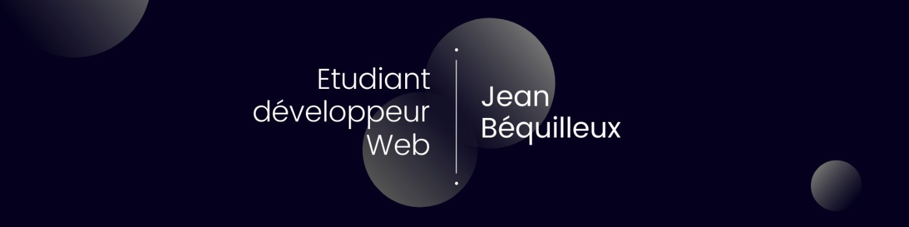

# 👋 Salut, je suis Jean !
### Développeur passionné ∙ Créatif ∙ Curieux



## À propos de moi

Développeur full-stack en fin de cursus, je travaille autant sur des interfaces Vue et Nuxt que sur des API en Symfony ou Node. Ce qui me motive, c'est de suivre une application de bout en bout, du composant front jusqu'au déploiement. En dehors du code, je passe pas mal de temps derrière un appareil photo et j'essaie d'apprendre une nouvelle techno dès que l'occasion se présente.

```javascript
const aboutMe = {
  pronouns: "il/lui",
  code: ["JavaScript", "PHP"],
  technologies: {
    frontEnd: ["Vue", "Nuxt", "HTML/CSS", "SASS"],
    backEnd: ["Symfony", "Node.js", "Express"],
    databases: ["PostgreSQL", "MySQL"],
    devOps: ["Docker", "GitHub Actions"],
  },
  passions: [
    "Progresser de jour en jour",
    "Prendre des photos",
    "Apprendre de nouvelles techs",
    "Le sport",
  ],
};
```

### En ce moment

Actuellement en alternance chez [Jean Lain Mobilités](https://mobilite.jeanlain.com/) pour valider mon MBA développeur full stack après l'obtention de mon bachelor. Je construis des applications web côté back comme côté front, avec un intérêt pour le déploiement et l'infrastructure.

### Statistiques


## Stack technique


## Projets

Quelques travaux qui résument bien ce que j'aime construire :

- **[Mon portfolio](https://jeanbequilleux.com)** développé et déployé par mes soins, du front jusqu'à la configuration du domaine et du DNS.

- **[Nomu](https://github.com/Nomu-MDS)** Projet scolaire d'application de voyage authentique, disponible sur mobile, web avec une administration web aussi. Gros travaux d'infrastructure & CI/CD sur ce projet.

- **Prêt VD (confidentiel)** Refonte d'un outil interne d'entreprise de prêt de véhicules de démonstration à des clients.

## 🤝 Connectons-nous !

[](https://linkedin.com/in/jean-bequilleux)
[](https://jeanbequilleux.com)
